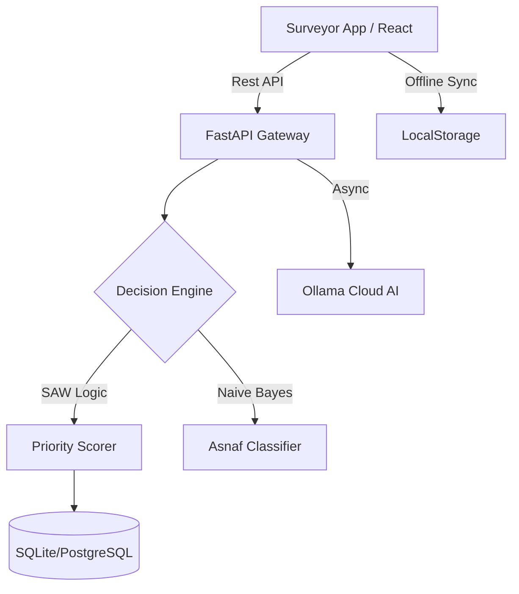

# 🕋 ZakatTrack: Modern Mustahik Analytics & GIS Platform

[](https://github.com/amsopian22/zakat-track)
[](https://github.com/amsopian22/zakat-track)
[](https://github.com/amsopian22/zakat-track)

**ZakatTrack** adalah platform *Decision Support System* (DSS) lintas platform yang dirancang untuk merevolusi tata kelola distribusi zakat. Dengan menggabungkan **Analisis Geospatial (GIS)**, **Algoritma SAW Scoring**, dan **Generative AI**, ZakatTrack memastikan setiap rupiah zakat tersalurkan secara presisi, transparan, dan berdampak nyata pada pengentasan kemiskinan (SDGs).

---

## 🚀 Fitur Unggulan (Premium Edition)

### 🧠 Inteligensia Buatan (AI Advisor)
Bukan sekadar data, ZakatTrack memberikan **Insight Strategis**.
- **Async AI Engine**: Integrasi Ollama Cloud (Ministral-3:8b) yang berjalan secara asinkron. Dashboard tetap responsif saat AI menganalisis ribuan data.
- **Floating Chat Widget**: Konsultan AI melayang yang siap memberikan rekomendasi penyaluran hanya dengan satu klik.

### 📶 Ketahanan Lapangan (Offline-First Sync)
Didesain untuk surveyor yang bekerja di daerah minim sinyal.
- **Smart Sync**: Input survey saat offline? Tidak masalah. Data disimpan aman di perangkat dan otomatis terkirim saat internet kembali aktif.
- **Connectivity Guard**: Indikator status koneksi real-time dengan badge antrean data tertunda.

### 📋 Wizard Survey & Automasi
- **Multi-Step Wizard**: Form survey 4-tahap yang intuitif (Identitas, Lokasi, Ekonomi, Sosial).
- **Auto-Rupiah Formatter**: Format mata uang otomatis saat pengisian pendapatan dan aset untuk akurasi data maksimal.
- **GPS Auto-Capture**: Pengambilan koordinat presisi secara otomatis dengan Map Picker interaktif.

### 🛡️ Integritas & Keamanan (Syariah Compliance)
- **Asnaf Guard Rails**: Sistem otomatis memblokir tombol penyaluran untuk kategori "Mampu". Menjaga dana zakat tetap pada jalurnya (Fakir/Miskin).
- **Anti-Fraud NIM**: Validasi unik NIK/NIM untuk mencegah duplikasi data mustahik secara real-time.

### 📄 Laporan Audit Penyaluran
- **Professional PDF Export**: Hasilkan laporan audit distribusi yang rapi, mencakup skor perangkingan dan analisis dampak, siap untuk dilaporkan ke stakeholder.

---

## 🏗️ Arsitektur Teknis



### Stack Teknologi
- **Frontend**: React.js, Vite, Leaflet (Map), Lucide Icons, Glassmorphism UI.
- **Backend**: FastAPI (Python 3.11), SQLAlchemy, Pydantic.
- **AI**: Ollama Cloud API (Model: `ministral-3:8b`).
- **Algorithm**: Simple Additive Weighting (SAW) untuk Multi-Criteria Decision Making.

---

## 🛠️ Instalasi & Konfigurasi

### 1. Kloning Repositori
```bash
git clone https://github.com/amsopian22/zakat-track.git
cd zakat-track
```

### 2. Persiapan Backend
```bash
# Buat virtual environment
python -m venv venv
source venv/bin/activate  # Mac/Linux

# Instal dependensi
pip install -r requirements.txt

# Buat file .env dan isi API Key Anda
cp .env.example .env
```

### 3. Persiapan Frontend
```bash
cd frontend
npm install
npm run dev
```

---

## 📊 Matriks Penilaian SAW (Logika Inti)

Sistem memberikan skor **0-100** berdasarkan kriteria berikut:
1. **Pendapatan (C1)** - Bobot 30% (Semakin kecil = makin berhak).
2. **Tanggungan (C2)** - Bobot 25% (Semakin banyak = makin berhak).
3. **Aset (C3)** - Bobot 15%.
4. **Status Rumah (C4)** - Bobot 10%.
5. **Pengeluaran (C5)** - Bobot 10%.
6. **Kesehatan/Disabilitas (C6)** - Bobot 10%.

---

## 🌍 Kontribusi SDGs
ZakatTrack secara otomatis melabeli setiap bantuan untuk mendukung:
- **SDG 1: Tanpa Kemiskinan**
- **SDG 2: Tanpa Kelaparan**

---

## 🤝 Kontribusi
Kami menerima kontribusi untuk pengembangan lebih lanjut. Silakan buat *Pull Request* atau laporkan *issue* jika ditemukan bug.

## 📄 Lisensi
Didistribusikan di bawah Lisensi MIT. Lihat `LICENSE` untuk informasi lebih lanjut.

---
*Dikembangkan untuk masa depan filantropi Islam oleh Antigravity AI @ PIDI 4.0 Ecosystem.*
